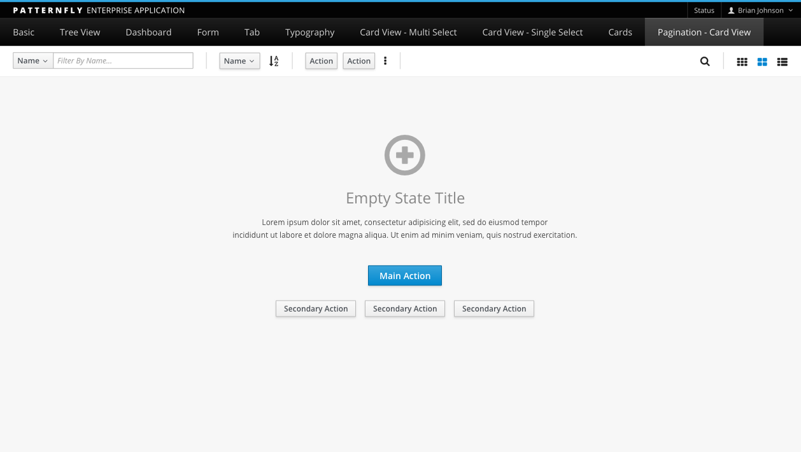

# Empty State

The goal of a empty state pattern is to provide a good first impression that helps users to achieve their goals. It should be used when a view is empty because no objects exists and you want to guide the user to perform specific actions. This may occur because the application is newly installed and content has not yet been created or added. This state may also result when all objects are deleted from a collection.

This pattern should NOT be used when:

- Selected filters cause an empty result. See [Filter](http://www.patternfly.org/pattern-library/forms-and-controls/filter/) for guidance on this use case.
- There is a connectivity issue and the data set cannot be obtained.

The empty state pattern is most often used in conjunction with one of the content views ([List View](http://www.patternfly.org/pattern-library/content-views/list-view/), [Table View](http://www.patternfly.org/pattern-library/content-views/table-view/), or [Card View](http://www.patternfly.org/pattern-library/content-views/card-view/).  Here the pattern is shown as it might appear in acontent view.

