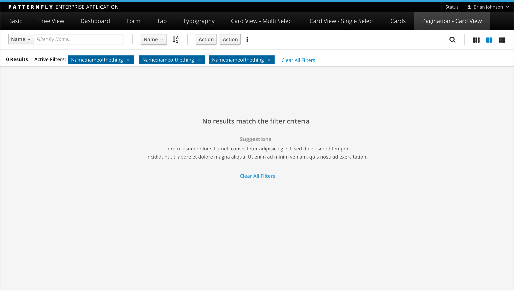
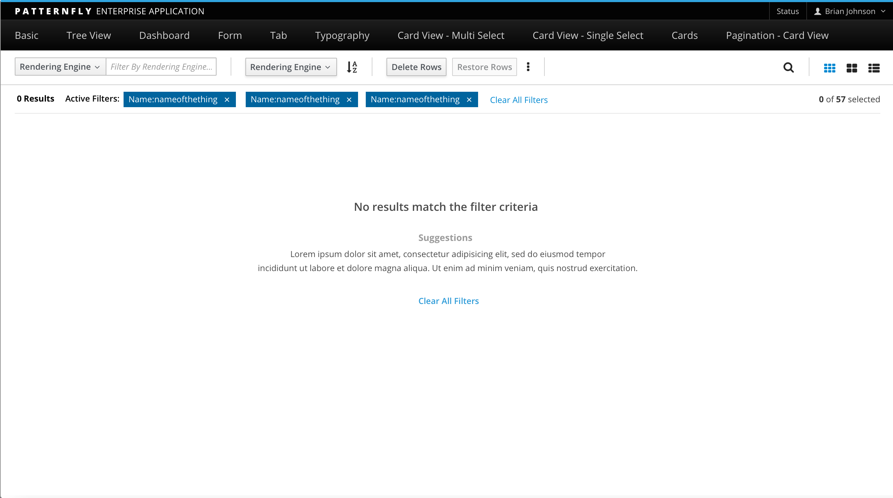

# Filter

## Filter Bar

  1. **Attribute Selector** (optional): Contains a list of the possible attributes by which to filter.

  1. **Filter Query Field:** Use when there are more than 15 possible values. The user’s filter query is entered here. The filter is activated when the user presses the “enter” key and all objects that do not have a match to this value are hidden.

  1. **Filter Query Dropdown** (optional): Use the filter query [dropdown](http://www.patternfly.org/pattern-library/widgets/#dropdowns "Widgets &#124; PatternFly") when there are less than 15 possible values to allow the user to select from a known and fixed value list (e.g a list of statuses). The filter is activated when the user selects a value. Objects that do not have this value are hidden.

  

## Active Filters Bar

1. **Active Filter:** Filters are labeled with the attribute and value used to create them. Clicking the X in the box will remove the filter. New filters appear to the right of existing filters and are highlighted briefly upon appearance. If no active filters exist, the active filters bar is hidden.

1. **Clear All Filters:** Clicking this action removes all currently active filters.

1. **Item and Results Count:** Design TBD

**Notes:**
- Each filter is additive in nature, meaning that adding further filters will reduce the overall set of results. Filters are combined with the AND boolean for the results they return.

- If an attribute can only have one filter value at any time, selecting a new value will replace the previous filter rather than adding a new one.

## Displaying a Null Result Set

Should the application of filters return 0 results, an empty state message will appear within the current view.

1. **Message:** Alert user that there are 0 results based on the filter criteria

1. **Suggestions:** A brief message suggesting how to fix the problem.

1. **Clear All Filters:** Clicking this will clear all applied filters and restore content to this view.

1. **Background:** The background color of this form will match the color of the current view. Note that in Table View, the background color is white.

This form will always be displayed within the current view and the Toolbar will remain active so that the user can modify filter criteria.

#### Null Result Set in Card or List View

#### Null Results in Table View

